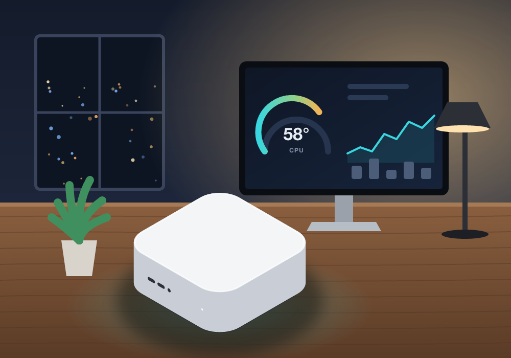
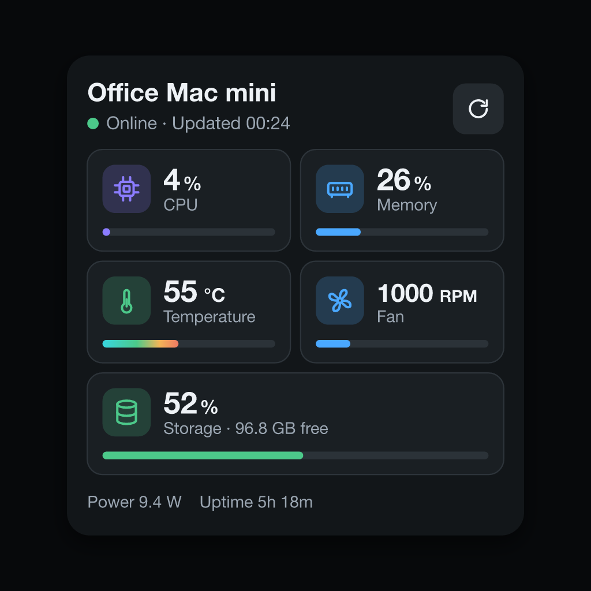

# Mac Monitor for Homey



Monitor and control your Macs from a Homey Pro. See temperatures, CPU load,
memory, disk space, fan speed and power draw, get notified when something is
off, and use Flows to sleep, wake, lock or restart a Mac.

Everything stays on your local network.

## How it works

Mac Monitor has two parts:

| Part | Runs on | Purpose |
|---|---|---|
| `agent/` | Each Mac | A small background service that reads the sensors and answers Homey on your local network |
| `app/` | Homey Pro | The Homey app: devices, Insights, Flow cards and a dashboard widget |

macOS does not share sensor data over the network, so the agent is required.
Install it on every Mac you want to add to Homey.

## Requirements

- A Mac with Apple silicon (M1 or later) running macOS 14 or later
- [Node.js](https://nodejs.org) 18 or later (LTS recommended), or `brew install node`
- A Homey Pro on the same local network as the Mac

## 1. Install the agent on your Mac

Open **Terminal** and run:

```bash
curl -fsSL https://raw.githubusercontent.com/kircuvaloglu/homey-mac-monitor/main/agent/get.sh | sudo bash
```

Enter your Mac password when asked (nothing is shown while you type). When the
installer finishes, it prints the Mac's addresses and an **access token**. Keep
the token; you need it in the next step.

<details>
<summary>Install from a downloaded copy instead</summary>

Download this repository (Code → Download ZIP), unzip it, then run:

```bash
cd ~/Downloads/homey-mac-monitor-main/agent
sudo bash install.sh
```

</details>

To show the token again later:

```bash
sudo cat /usr/local/etc/homey-mac-agent/config.json
```

The agent starts automatically when the Mac starts, even before anyone logs in.

## 2. Add the Mac in Homey

1. Install **Mac Monitor** from the Homey App Store.
2. In the Homey app, go to **Devices → Add device → Mac Monitor → Mac**.
3. Your Mac appears under **Found on your network**. Select it, paste the token
   and tap **Connect**.

If the Mac is connected to more than one network, use the address on the same
network as your Homey.

## What you get

### Readings

CPU temperature, GPU temperature, CPU usage, load per core, memory usage, free
disk space, disk usage, fan speed, power draw, uptime, pending macOS updates and
a thermal throttling alarm, with Insights history.

The device settings also show model, serial number, macOS version, processor,
memory, IP address, MAC address, boot time and the last update check.

### Flow cards

**When:** CPU usage rises above / drops below, memory usage rises above / drops
below, free disk space drops below / rises above, fan speed rises above, a macOS
update becomes available, the Mac restarted, the Mac becomes unreachable or
reachable again. Homey also provides its own cards for CPU and GPU temperature,
power draw and the thermal throttling alarm.

**And:** the Mac is reachable; CPU temperature, CPU usage, memory usage, free
disk space, fan speed or power draw is above a value; an update is available;
the thermal throttling alarm is on.

**Then:** put the Mac to sleep, wake it, turn off the display, lock the screen,
show a notification, run a command, refresh the readings, check for macOS
updates, restart, shut down.

Threshold cards fire once when the value crosses the threshold, not on every
update while it stays there.

### Dashboard widget

The **Macs** widget shows a card for every Mac with its status, CPU, memory,
temperature, fan and storage, plus a refresh button. Values turn yellow or red
when a Mac runs hot or low on disk space.



## Setting up actions

**Wake-on-LAN.** Turn on **System Settings → Energy → Wake for network access**
on the Mac. Wake-on-LAN wakes a sleeping Mac; a Mac that is shut down cannot be
started remotely.

**Restart and shut down** are disabled by default so that a Flow cannot turn off
a Mac by mistake. To use them:

1. In Homey, open the Mac's device settings and turn on **Allow restart and shut down**.
2. On the Mac, set `"restart": true` and `"shutdown": true` in
   `/usr/local/etc/homey-mac-agent/config.json`, then run:

   ```bash
   sudo launchctl kickstart -k system/com.homey.macagent
   ```

**Lock and notifications** need a user to be logged in on the Mac. Lock starts
the screen saver, so set **Require password after screen saver begins** to
**Immediately** in System Settings → Lock Screen.

**Commands.** Add your own scripts to the agent's `config.json` and run them
from a Flow. The script output is available as a Flow token.

```json
"commands": {
  "backup": "/Users/me/bin/backup.sh"
}
```

After changing `config.json`, restart the agent with the `launchctl kickstart`
command above.

## Uninstall

```bash
sudo /usr/local/libexec/homey-mac-agent/uninstall.sh --purge
```

Without `--purge` the config and token are kept for a later reinstall.

## Security

- Every request needs the access token.
- Only requests from private networks are accepted. To limit access further,
  list the allowed addresses in `allowedIPs` in `config.json`.
- Actions come from a fixed list; nothing from a request is passed to a shell.
- The agent only reads sensors. It never changes fan speeds or other hardware
  settings.
- Do not expose port 8787 to the internet.

## Troubleshooting

- **The Mac is not found in Homey.** Enter the Mac's IP address manually. Make
  sure the Mac and Homey are on the same network and that the macOS firewall
  allows incoming connections for `node`.
- **"The Mac is not responding".** The Mac is asleep, shut down or the agent is
  not running. Check with `curl http://127.0.0.1:8787/ping` on the Mac.
- **No temperature or fan data.** Reinstall the agent; the log is in
  `/var/log/homey-mac-agent.log`.
- **GPU temperature is missing.** The GPU sensor only reports while the GPU is
  in use; the value appears after the first reading.

## Agent HTTP API

```
GET  /ping                      no token; returns the service name and Mac name
GET  /status                    all readings (token required)
GET  /status?updates=refresh    runs a macOS update check first
POST /action  {"action":"...", "params":{}}
```

Actions: `sleep`, `displaysleep`, `lock`, `notify`, `restart`, `shutdown`,
`command`.

```bash
curl -H "Authorization: Bearer $TOKEN" http://MAC_IP:8787/status | python3 -m json.tool
```

## Development

```bash
cd app
homey app validate
homey app install
```

- `agent/build.sh` builds the bundled sensor reader.
- `tools/make-images.py app` renders the app and driver images and icons.
- `tools/make-widget-preview.py app/widgets/macs` renders the widget previews.
  Both scripts need `pip install pillow resvg-py`.
- `agent/macsensors --all` lists every SMC key, which helps when mapping the
  sensors of a new Mac model.

More notes are in [DEVELOPMENT.md](DEVELOPMENT.md).

## License

[MIT](LICENSE)
